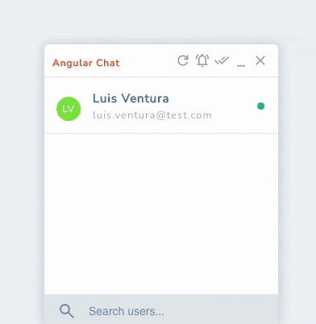

# ChatApp

Sample Chat App in Angular with support for rooms, edit, reply, emojis, send images,
desktop notifications and more.

## Development server

Run `ng serve` for a dev server. Navigate to `http://localhost:4200/`. The application will automatically reload if you change any of the source files.

